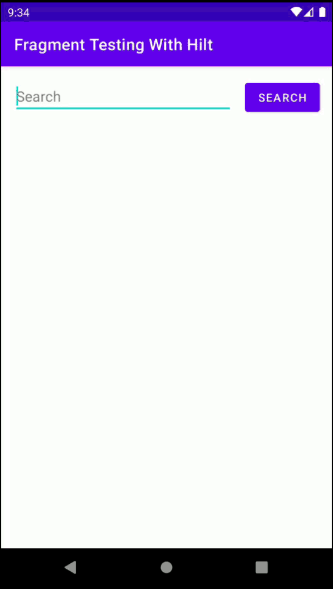
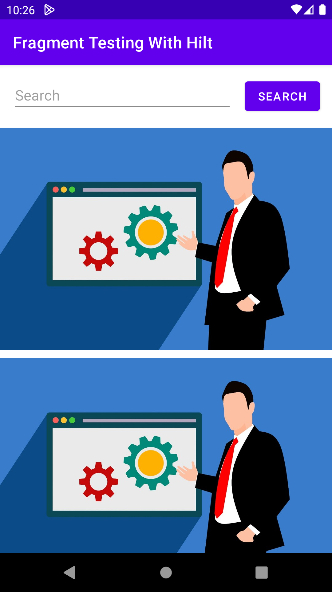

# Fragment-Testing-With-Hilt

<div align="left">
 
</div>


## Table of Contents
* [About The Project](#about-the-project)
* [Tech](#tech)
* [How to](#how-to)
* [Test Result](#test-result)
* [License](#license)
* [Contact](#contact)


## About The Project
This is a project that has been created in order to explain launching a fragment with hilt in a test and testing the screen.


## How to
Click on this [blog article link](https://mutkuensert.blogspot.com/2022/09/hilt-kullanlan-projede-fragment-testi.html) to read my explanation of how to make this test.(Written in Turkish)


## Test Result
<div align="left">
 
</div>


## Tech
* [Coroutines](https://developer.android.com/kotlin/coroutines) - To execute asynchronous tasks.
* [Hilt](https://developer.android.com/training/dependency-injection/hilt-android) - Automatized dependency injection library.
* [Hilt](https://dagger.dev/hilt/) - Hilt documentation on dagger.dev.
* [Moshi](https://github.com/square/moshi/) - JSON library to parse JSON.
* [Retrofit](https://square.github.io/retrofit/) - To make HTTP requests.
* [ViewModel](https://developer.android.com/jetpack/androidx/releases/lifecycle) - Link for ViewModel dependencies.
* [Glide](https://github.com/bumptech/glide) - To load images in ImageViews.


## License
```xml
Copyright 2022 Mustafa Utku Ensert

Licensed under the Apache License, Version 2.0 (the "License");
you may not use this file except in compliance with the License.
You may obtain a copy of the License at

    http://www.apache.org/licenses/LICENSE-2.0

Unless required by applicable law or agreed to in writing, software
distributed under the License is distributed on an "AS IS" BASIS,
WITHOUT WARRANTIES OR CONDITIONS OF ANY KIND, either express or implied.
See the License for the specific language governing permissions and
limitations under the License.
```


## Contact
[ensertyazilim@gmail.com](#)
